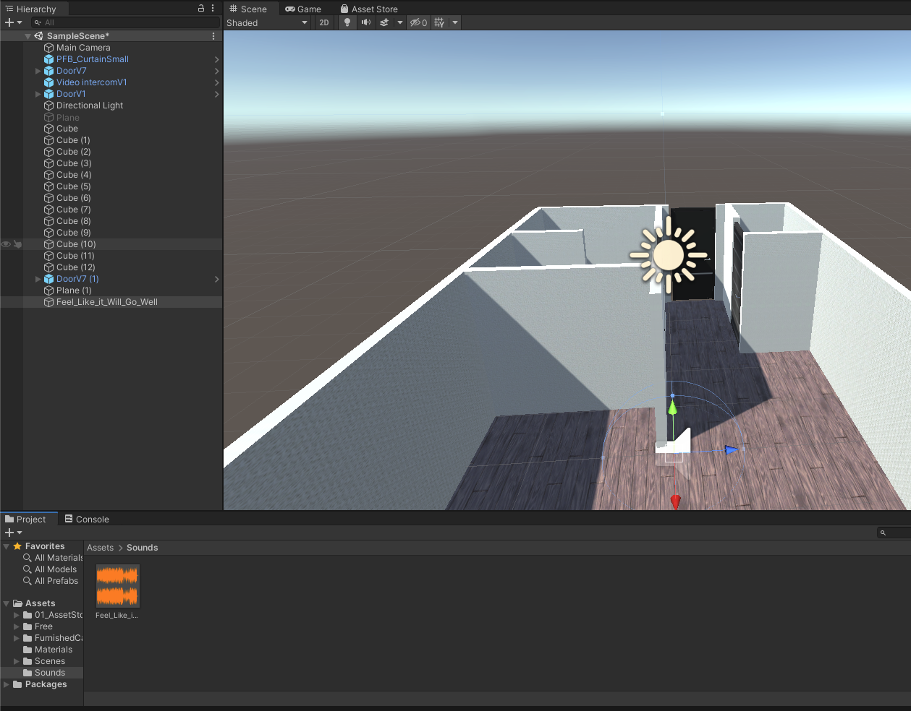
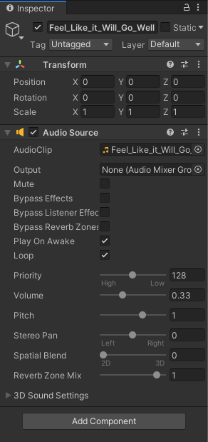
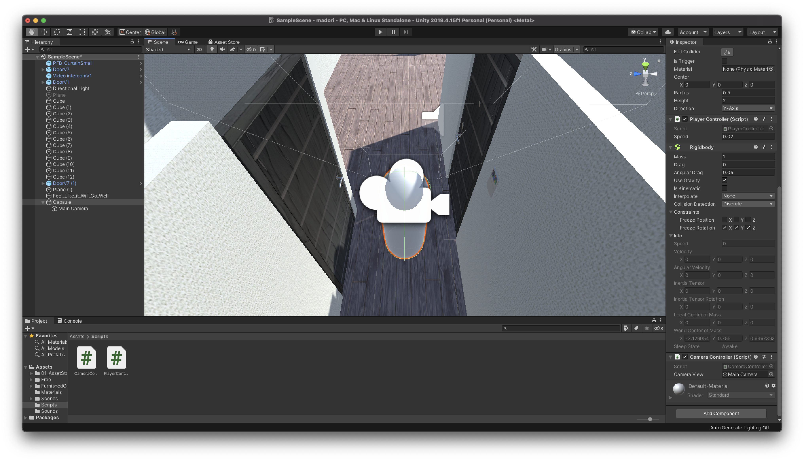
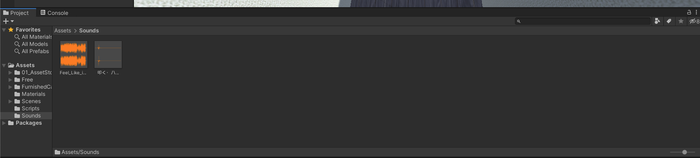

# アプリの軽量化について

## VRパフォーマンスの最適化について

 

### 概要

VRアプリの最適化は簡単ではありません。間違った方法で行ったために、コードを最適化したものの、アプリの全体的なパフォーマンスは結局向上しなかったということも起こり得ます。本当のボトルネックがどこにあるのかを特定して、そこに集中し、そのセクションをまず最適化することが重要です。

VRのパフォーマンスの問題には、一般的にCPUとGPUの問題があります。CPUは通常、シミュレーションロジック、状態管理、レンダリングするシーンの生成に関係する処理を担当します。一方GPUはシーン内のメッシュのテクスチャーとシェーディングのサンプリングに関係する処理を担当します。パフォーマンスの問題がCPU負荷とGPU負荷のどちらによるものなのかを判断し、それに応じてコードを最適化することが重要です。

アプリ内の1つの領域がシステムの処理時間の大部分を占有し、残りの領域が消費する割合が小さいということは珍しくありません。まずは問題となる大きな領域を最適化することに狙いを定めます。

アプリを最適化するときは、一度に１箇所ずつ変更するようにしましょう。特に複雑なVRアプリでは、今回行う変更が前回の変更に大きな影響を及ぼす場合があるので注意してください。アプリのパフォーマンスの低下の原因を突き止めようとしているのであれば、バージョン管理ソフトウェアの履歴で、発生しているパフォーマンスの問題の原因となった単一の変更を特定します。複数の変更が影響し合って1つのパフォーマンスの問題が発生するようになったとは考えないでください。

### パフォーマンスの問題の一般的な原因

ほとんどの場合、パフォーマンスの問題は下記の問題が原因で発生します（重要度の高い順）。

| パフォーマンスの問題 | リソースコスト |
|:--|:--|:--|
| シャドウや反射など、依存関係のレンダリングが必要となるシーン | CPU、GPU |
| 描画呼び出しを発行するためのVertex Buffer Objects(VBO)のバインディング | CPU、グラフィックドライバー |
| 透明度、マルチパスシェーダー、ピクセル単位の照度、及び多数のピクセルを塗りつぶすその他の効果 | GPU |
| 大規模なテクスチャーの読み込み、ブリット、その他の形式のmemcpy | GPU、メモリーコントローラー |
| スキンアニメーション | CPU、GPU |
| Unityガベージコレクションのオーバーヘッド | CPU |

## プロファイラを確認する

まず一番最初にやることは**プロファイラを見ること**です。これを見ると自分のUnityアプリのどこがボトルネックになっているのかをほぼ確実に特定できます。どこが悪さしているのかを確認するのは非常に重要なので、必ずチェックしましょう。

プロファイラは「Window -> Analysis -> Profiler」で確認することができます。

 

プロファイラを開いたら、「Record」がオンになっていることを確認し、その状態でUnityのシーンを実行してみましょう。  
そうすると、プロファイラが起動し、上記の画像のようにグラフが表示されるかと思います。

この画面で注目するのが「CPU Usage」です。  
CPUがどのように使われているのかや、フレームレートを確認することができます。

CPU Usageの項目について簡単に説明していきます。

 

### Rendering

緑色のグラフは描画全般にかかった時間を示しています。主に不透明・透明オブジェクトの描画、影処理、遅延描画処理、ポストプロセス処理、UI描画処理にかかった時間がここに含まれています。このグラフがCPUの大部分を占めている場合は、描画系の処理の仕方を見直さなければなりません。

Renderingが悪さをしていると判明した場合、次に見るべきはGPU UsageとRenderingです。GPU Usageはデフォルトで隠れているのでAdd ProfilerからGPUを選択しGPUプロファイリングを有効にしてください。すると先程説明した描画の詳細をグラフで見ることができます。

そして下の方にレンダリングの詳細画面があります。

ここではまずはDrawCall数を確認してください。

DrawCallとは、グラフィックスAPI を使用して、画面に描画を行う際に呼び出す命令の事です。

具体的には下記のような関数が該当します。(ここで並べているのは一部です)

ID3D11DeviceContext::DrawIndexed()  
glDrawElements()  
これらの関数を呼び出すことで初めて GPU は駆動し、フレームバッファのメモリ情報が書き換わることになります。

当然、Unity なども内部で glDrawElements() や DrawIndexed() を呼び出して描画を行っており、この Draw関数の一度の呼び出しが、1 DrawCall になります。

ちょっと難しいかもしれないので、まずはこのDrawCallが100以下になっていれば大丈夫だと思ってください。

### Rendering

青色のグラフはスクリプト全般にかかった時間を示しています。独自にコーディングしたスクリプトやUnityビルトインスクリプト(MonoBehaviourなど)がScriptsに含まれています。ここが乱れていたりスパイク(一瞬だけすごく時間がかかっている)が立っていたりする場合スクリプト周りを見直さなければなりません。

### Physics
オレンジ色のグラフは物理処理全般にかかった時間を示しています。剛体(Rigidbody)、衝突判定、拘束処理、レイキャスト、トリガーなどが含まれています。このグラフは比較的乱れやすくスパイクも立ちやすいので、物理処理を多用している場合は優先的に見直した方が良いです。

### Animation
水色のグラフはアニメーション全般にかかった時間を示しています。AnimatorやAnimationによるFK,IKのスキンメッシュアニメーション(ボーンアニメーション)がここに含まれています。アニメーション数が多かったりボーンやIK構造が複雑だと乱れやすくなります。

### GarbageCollector
黄土色の様なよく分からない色のグラフはガベージコレクションにかかった時間を表しています。メモリ管理が甘いとスパイクが頻繁に立ちその度に一瞬アプリが硬直します。

### UI
紫色のグラフはUI全般にかかった時間を示しています。説明するまでもなくUIのレイアウトや描画がここに含まれています。様々なテキストやテクスチャを動かしたりたくさん描画したりすると重くなったりします。

### その他(VSync, Global Illmination, Other)

上記以外のVSync, Global Illmination, Otherは基本気にしなくて大丈夫です。一応簡単に説明すると、

Vsync : リフレッシュレートに合わせてCPUを待機させている時間  
Global Illmination : 大域照明(環境光や反射光を考慮した照明)にかかった時間。非常に重いため高精細表現をしない限り使わない  
Other : それ以外にかかった時間。分別不能な内部処理のため考慮しなくていい。  
となります。

プロファイラでボトルネックが判明したら、実際に見直していきます。

 

## クオリティを見直す

Unityのクオリティを見直すだけでも動作が改善されます。VRアプリはオーバースペックな設定をすべきではないので、ぜひ見直していきましょう。

「Edit -> ProjectSettings -> Quality」を開いてください。すると以下の画面が表示されます。

設定すべきは以下の項目です。
※ケースバイケースなので自分のプロジェクトにあった設定をしてください

### Pixel Light Count を小さくする。もしくは0にする
もし、プロジェクト内でライトを使っていない場合はPixel Light Countを0にしてください。ライトを扱っている場合はできる限り小さい値にしてください。これで無駄なライト処理が省かれます。

### Texture Qualityを下げる
高精細なスプライトやテクスチャを必要としていない場合はHalf Res以下にしましょう。

### Anisotropic Texturesをオフにする
異方性フィルタリングを扱わない場合はDisableにしましょう。

### Anti Aliasingをオフにする
ジャギーが気になる場合を除いてDisableにしましょう。

### Soft Particlesをオフにする
ポリゴンとの境界付近にパーティクルを描画しないのであればSoft Particleは必要ないのでオフにしましょう。

### Realtime Reflection Probesをオフにする
スマートフォンアプリなら必要ないことがほとんどなのでオフにしましょう。

### Resolution Scaling Fixed DPI Factorを下げる
スマートフォンは解像度が高く描画負荷も大きいため0.5くらいにしても問題ないです。

### Texture Streamingをオフにする
普段使わないはずなのでオフにしましょう。

### Shadowsを無効にする
もしプロジェクト内で影を扱わないのであればShadowsをDisable Shadowsにしましょう。影の計算が省かれます。

### Shadow Resolutionを下げる
影の深度バッファ解像度です。高いと描画負荷も高いので低くしましょう。

### Blend Weightsを少なくする
スキニングのボーンブレンド数です。精細なスキンメッシュアニメーションを求めていないのであれば1 Boneにしましょう。

### VSync Countを無効にする
画面のリフレッシュレートに合わせて同期させるかの設定です。基本的に自分でプロジェクトにあったフレームレートを設定した方がよいのでDon't Syncにしましょう。

### Particle Raycast Budgetを下げる
パーティクルの衝突レイキャストの最大数です。パーティクルの品質を求めていないのであれば4, 16辺りに設定しましょう。

### Rigidbody, Collider, Jointは最低限にする
まず、Unityは物理エンジンとしてPhysXを使っています。内製のものもありますがデフォルトはPhysXです。物理エンジンは基本的に物理世界を内部で作り、RigidbodyやColliderを登録し、毎フレームシミュレーションを行い、シミュレーション結果を返します。レイキャストは個別に受け付けています。UnityのコンポーネントであるRigidbodyやColliderは内部でPhysXのRigidbodyとColliderと結びついているんですね。

そんな物理エンジンですが、想像通り基本重いです。古い端末だと顕著に重くなります。重さはRigidbodyやColliderの数に比例します。特にRigidbodyは重いです。なので、無駄な使い方をしないように心がけるのが良いです。例えば、自由落下するだけならわざわざRigidbodyを使わなくてもコードで-Y方向に移動させればいいですし、複雑な衝突をしない限り単純なコードで代用できるならなるべくそうすべきです。

当たり前のことを綴っているだけですが、一番負荷を削減できる事なので常に意識しましょう。

### なるべく動かさない
実は、RigidbodyやColliderの数が多くても負荷がかからない様にする方法があります。それは、動かさないことです。物理エンジンはstaticもしくは動かないと判断したオブジェクトはsleep状態に入り無駄な物理処理を行わない様になります。なので、なるべく物理オブジェクトは動かさない様にしましょう。

### オクルージョンカリングを有効活用する
オブジェクト数が多い時に有効なのはオクルージョンカリングです。これはオブジェクトの後ろに隠れているオブジェクトの描画を行わないというもので、ドローコール数自体を下げパフォーマンスを上げる事ができる非常に優れた手法です。似たカリング手法にフラスタムカリングがあります。これはカメラの描画領域外のオブジェクトを描画しないというものです。似ているので注意しましょう。

フラスタムカリングはUnityは自動で行ってくれますが、オクルージョンカリングは手順を踏まなければ自動で行ってくれません。比較的簡単に設定できるので、ぜひ設定しましょう。

まず、シーン上で動かないオブジェクトを選択します(フィールドや小物等)。次に選択したオブジェクトが遮蔽物になるか遮蔽されるものになるかを決めます。例えば、フィールド上に配置された小物は遮蔽されるもので、壁などは遮蔽物となりますね。決めたらインスペクタ上で遮蔽物はOcculuder Static, 遮蔽されるものはOccludee Staticを指定してあげましょう。Staticの隣の逆▼から選ぶことができます。

指定が終えたら、[Window] - [Rendering] - [Occlusion Culling]を選択します。するとオクルージョンカリング設定が開かれるので、そのまま[Bake]でオクルージョンエリアを作成しましょう。これで、カメラに隠れたもの(遮蔽されるもの)は描画対象外になります。

動くものには適用されないので、動かないとわかっているオブジェクトにだけ設定してあげましょう。

### ポストプロセスをなるべく使わない
以前までの講習で使用していたエフェクト類です。これらはすべてピクセルシェーダで行われるので非常に高価な処理となります（画面全体の1ピクセル毎にエフェクト効果を適用するイメージ）。そのため、スマートフォン向けアプリではできる限り使うべきではありません。見た目はよくなりますが非常に重いです。パフォーマンスとグラフィックのトレードオフの代表格なので注意しましょう。

使用するときも最低限にしておくと軽量なアプリとなるはずです。

 

上記すべてを実践する必要は全くありません。見た目とのトレードオフなものがほとんどなので、自分に合った見直しを行っていただければ十分です。

簡単にまとめると、以下の様になります。

- 不必要なオブジェクト・コンポーネントは置かない
- シーン中に動的生成・破棄はなるべくしない
- 重い処理を認識してなるべく使わない

軽量化はプロでも大変な作業ですので、問題が起きた時に1つずつ確実に解決できるように今回の内容は覚えておきましょう。

[こちら](https://qiita.com/neon-izm/items/c95f86de45f23a0dd791)の記事等が参考になるかと思います。

また、Oqulus Questでのパフォーマンス分析について詳しく知りたい方は[こちら](https://developer.oculus.com/documentation/unity/unity-perf/)の公式サイトをご確認ください。

